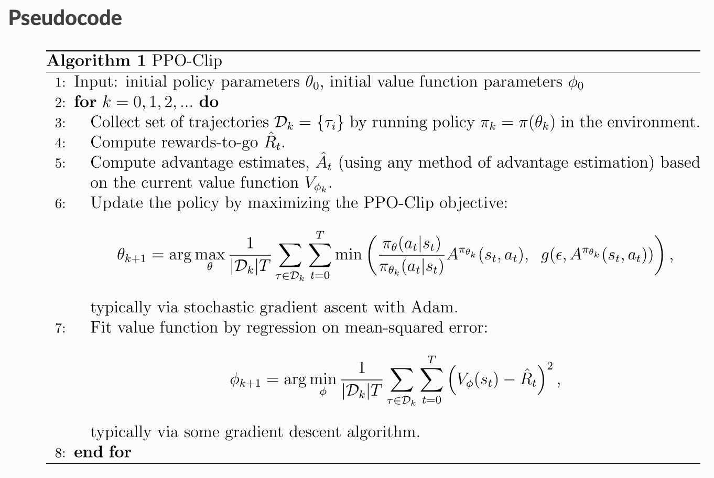
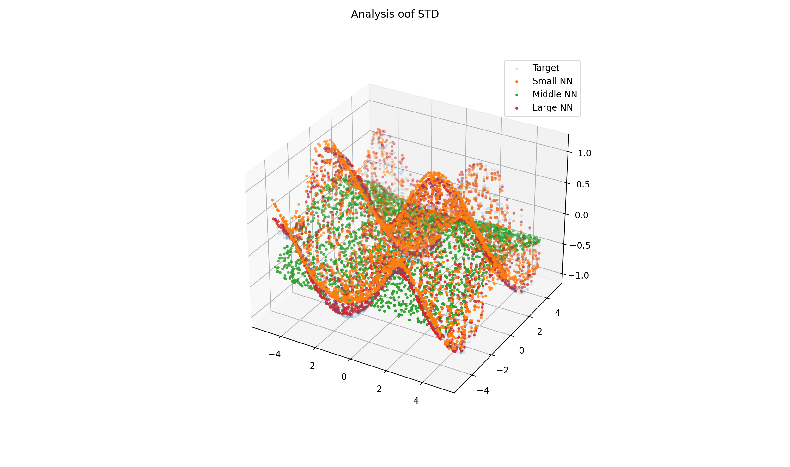
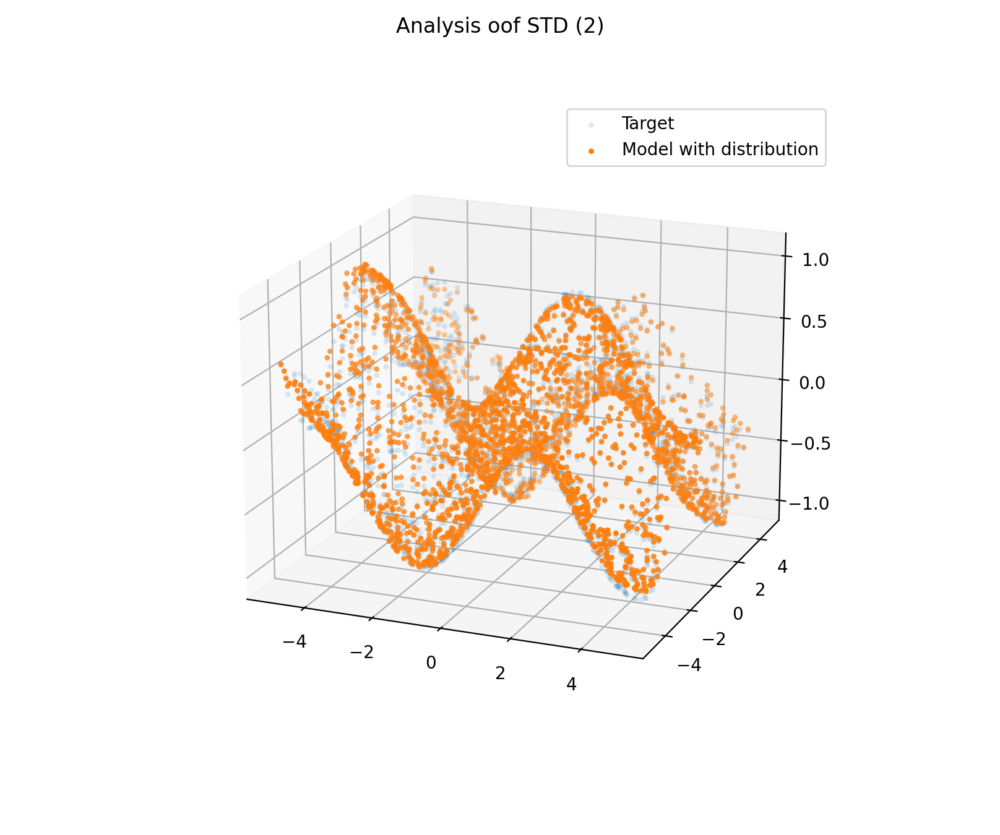

# PPO implementation (Variant II)

## PPO




## Analysis 

### Different sizes of NN



### Model with mean and std



### Things one can compare with other example implementations

Compare: my run, [example 1](https://github.com/zzzxxxttt/pytorch_simple_RL/blob/master/ppo_mtcar.py), [example 2](https://github.com/Abhipanda4/PPO-PyTorch)

Component | my run | example 1 | example 2
--- | --- | --- | ---
NN                               | --- | --- | 1 |
Sample trajectories              | 1 | --- | 1 |
Wrap states                      | --- | --- | 1 |
Wrap rewards                     | 1 | --- | 1 |
Calculate returns and advantages | 1 | --- | 1 |
Critic update                    | 1 | --- | 1 |
Actor update                     | 1 | --- | 1 |

Parameter | my run | example 1 | example 2
--- | --- | --- | ---
n of updates | --- | 100 | 300 |
batch size | --- | 10000 | 5000 |
GAMMA (discount rate) | --- | 0.99 | 0.995 |
EPSILON (clipping ratios) | --- | 0.2 | 0.1 |
LAMBDA / TAU (for GAE) | --- | 0.97 | 0.97 |
ENTROPY ALPHA | --- | 0.02 | --- |
Actor LR | --- | 0.001 | 0.001 |
Critic LR | --- | 0.001 | 0.001 |


# !!! What was important:
- Clipping actions brought the std of action to explosion

- Add an entropy term

- Normalize the statistics of the state/observation

- Add `torch.no_grad()` when it needed. Improvement was immediate
```python
with torch.no_grad():
    # SAMPLE TRAJECTORIES
    ...
    # COMPUTE RETURNS AND ADVANTAGES
    ...
```

## Credits:

- [TDS | Why Data should be Normalized before Training a Neural Network](https://towardsdatascience.com/why-data-should-be-normalized-before-training-a-neural-network-c626b7f66c7d#:~:text=Among%20the%20best%20practices%20for,and%20leads%20to%20faster%20convergence.)

### PPO

- [Environments in OpenAI (Leaderboard)](https://github.com/openai/gym/wiki/Leaderboard#lunarlander-v2)
- [PPO (OpenAI's blog)](https://openai.com/blog/openai-baselines-ppo/)
- [PPO implementation from Deep-Reinforcement-Learning-Hands-On-Second-Edition (page 606)](https://github.com/PacktPublishing/Deep-Reinforcement-Learning-Hands-On-Second-Edition/blob/master/Chapter12/02_pong_a2c.py)
- [Optimization In Pytorch-Lightning](https://pytorch-lightning.readthedocs.io/en/latest/common/optimizers.html#automatic-optimization)
- [Adam Grad - page 36 (Training NNs from Stanford's course)](http://cs231n.stanford.edu/slides/2017/cs231n_2017_lecture7.pdf)
- [Kullback–Leibler divergence (wikipedia)](https://en.wikipedia.org/wiki/Kullback%E2%80%93Leibler_divergence)
- [Kullback–Leibler divergence (YouTube video) - great](https://www.youtube.com/watch?v=ErfnhcEV1O8&ab_channel=Aur%C3%A9lienG%C3%A9ron)
- [1 - PPO implementation](https://colab.research.google.com/github/nikhilbarhate99/PPO-PyTorch/blob/master/PPO_colab.ipynb#scrollTo=yr-ZjT_CGyEi)
- [2 - PPO implementation with PL](https://github.com/sid-sundrani/ppo_lightning/blob/master/ppo_model.py)
- [3 - PPO implementation - OpenAI Spinning Up](https://spinningup.openai.com/en/latest/algorithms/ppo.html)


