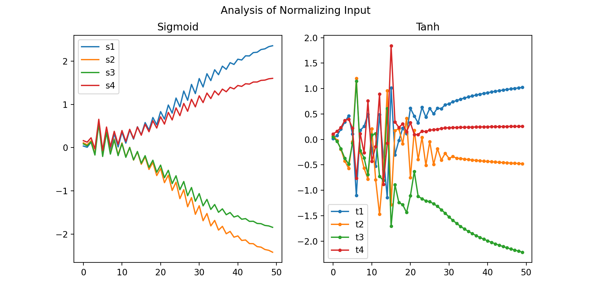

# PPO implementation (Variant II)

## PPO


## Analysis 

### Different sizes of NN


### Model with mean and std


### Importance of Normalizing Input

#### Sigmoid vs Tanh

There are the same NN weights, input and optimizer. The only difference is the non-linearity function.



### Things one can compare with other example implementations

Compare: my run, [example 1](https://github.com/zzzxxxttt/pytorch_simple_RL/blob/master/ppo_mtcar.py), [example 2](https://github.com/Abhipanda4/PPO-PyTorch)

Component | my run | example 1 | example 2
--- | --- | --- | ---
NN                               | --- | --- | 1 |
Sample trajectories              | 1 | --- | 1 |
Wrap states                      | --- | --- | 1 |
Wrap rewards                     | 1 | --- | 1 |
Calculate returns and advantages | 1 | --- | 1 |
Critic update                    | 1 | --- | 1 |
Actor update                     | 1 | --- | 1 |

Parameter | my run | example 1 | example 2
--- | --- | --- | ---
n of updates | --- | 100 | 300 |
batch size | --- | 10000 | 5000 |
GAMMA (discount rate) | --- | 0.99 | 0.995 |
EPSILON (clipping ratios) | --- | 0.2 | 0.1 |
LAMBDA / TAU (for GAE) | --- | 0.97 | 0.97 |
ENTROPY ALPHA | --- | 0.02 | --- |
Actor LR | --- | 0.001 | 0.001 |
Critic LR | --- | 0.001 | 0.001 |


# !!! What was important:
- Clipping actions brought the std of action to explosion

- Add an entropy term

- Normalize the statistics of the state/observation

- Add `torch.no_grad()` when it needed. Improvement was immediate
```python
with torch.no_grad():
    # SAMPLE TRAJECTORIES
    ...
    # COMPUTE RETURNS AND ADVANTAGES
    ...
```

## Credits:

- [TDS | Why Data should be Normalized before Training a Neural Network](https://towardsdatascience.com/why-data-should-be-normalized-before-training-a-neural-network-c626b7f66c7d#:~:text=Among%20the%20best%20practices%20for,and%20leads%20to%20faster%20convergence.)

- [GitHub | PPO example 1](https://github.com/zzzxxxttt/pytorch_simple_RL)
- [GitHub | PPO example 2](https://github.com/Abhipanda4/PPO-PyTorch)
- [PyTorch | REPRODUCIBILITY](https://pytorch.org/docs/stable/notes/randomness.html)


